## 编译的完整过程：

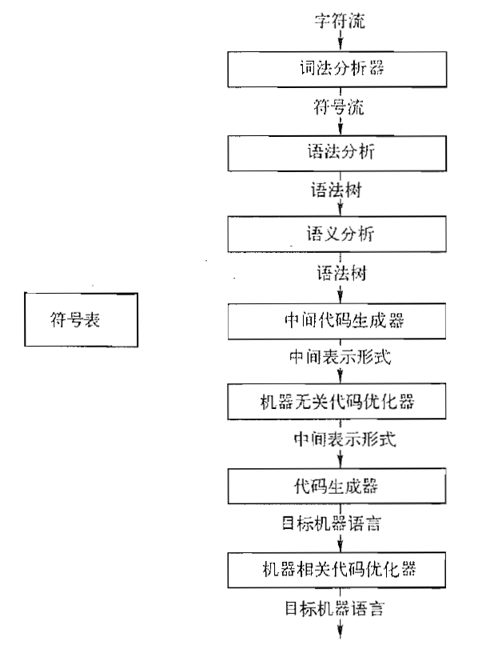

## 第二章-简单总览

### 上下文无关文法（Context Free Grammar）

四个组成部分：

- 一个终结符号集合（终结符号简单理解就是关键字，括号等）（终结符号有时也称作词法单元）

- 一个非终结符号集合（如变量expr和表达式stmt）

- 一个产生式集合（这是个人认为最重要的一部分，可以理解为用递归的方法定义了非终结符号的生成规则，正是由于有产生式，才能形成千变万化的语法结构）

  ```c
  // 一个产生式的例子：
  stmt -> if (expr) stmt else stmt
  ```

- 指定一个非终结符号为开始符号

### 语法分析树

给定一个上下文无关文法，该文法的一颗语法分析树是具有以下性质的树：

1. 根节点为文法的开始符号
2. 每个叶节点为一个终结符号或空串
3. 每个内部节点标号为一个非终结符号
4. 如果非终结符号A是某个内部节点的标号，且它的子节点标号为X1, X2, ……Xn, 则必存在一个产生式A->X1 X2 …… Xn，其中Xi可以是终结符号也可以是非终结符号。

二义性：如果一个文法可以为一个句子生成多颗语法分析树，则这个文法有二义性

通常需要无二义性的文法，或用附加规则消除二义性（即在二义性文法产生多颗树时，消除多余的语法树）。

## 词法分析

### 概述

- 定义：读入源程序的输入字符、将它们组成词素，生成并输出一个词法单元(token)序列。
- 词法分析使得翻译器可以处理多个字符组成的构造，比如count+1中，标识符count被识别为一个单元。

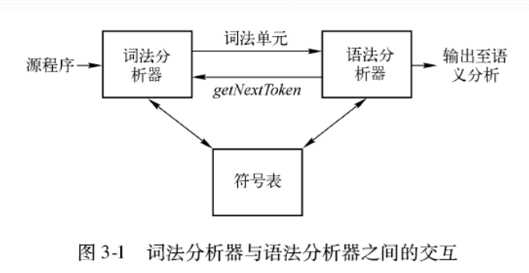

三个名词：词法单元（包括单元名和可选的属性值），模式，词素

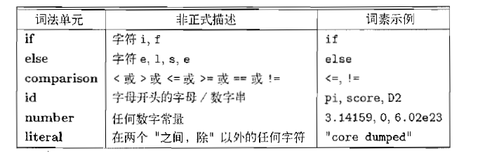

### 词法单元的规约（正则表达式）

正则表达式：一种描述模式的方法，本质上是通过归纳和递推来定义的。

正则表达式相关概念：字母表、串、语言、语言上的运算

每个正则表达式r可以描述一个语言L(r)，也即其定义的正则集合。

基本运算有三种：选择（并）、连接、闭包，同时还有很多扩展符号，如+，[A-Z]等

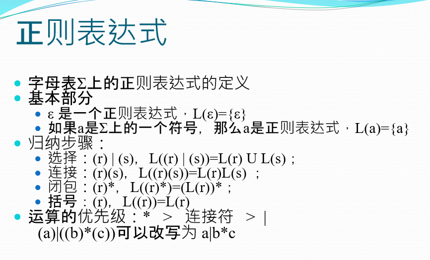

一些例子：

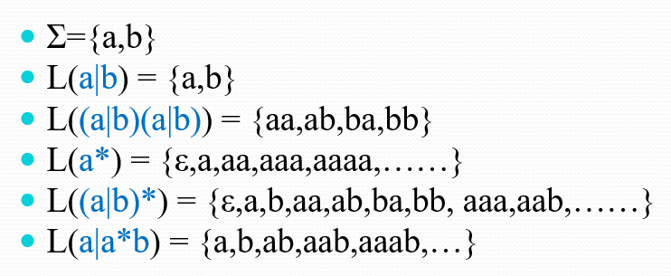

### 词法单元的识别（状态转换图）

可以由正则表达式翻译而来

体现了识别一个状态（词素）之后如何进入下一个状态，如何退出等，即具体怎么识别词法单元。

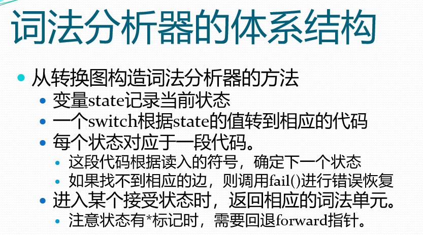

### 有穷自动机

Lex（词法分析器生成工具）的核心，本质上等价与状态转换图

区别在于：自动机是识别器，对每个输入串回答yes or no

分为两类：不确定的有穷自动机（Nondeterministic Finite Automate，NFA），确定的有穷状态自动机（Deterministic Finite Automate，DFA）

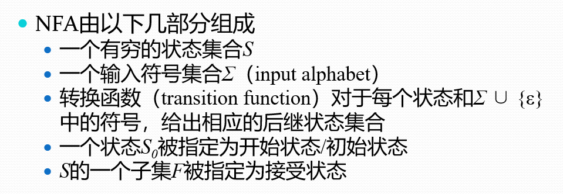

（接受状态也叫终止状态）

区别：NFA中，一个符号可以标记离开同一状态的多条边，如下图所示：（0状态有两条边都是a）

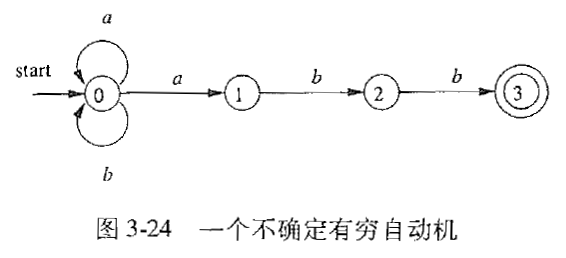

但是说实话，不太明白空串符号$\epsilon$引入NFA中有什么意义（现在明白了，看下图，感谢崔家才学长的[网站笔记](https://fla.cuijiacai.com/02-fa/#_2-4-%E5%B8%A6%E7%A9%BA%E8%BD%AC%E7%A7%BB%E7%9A%84nfa)）

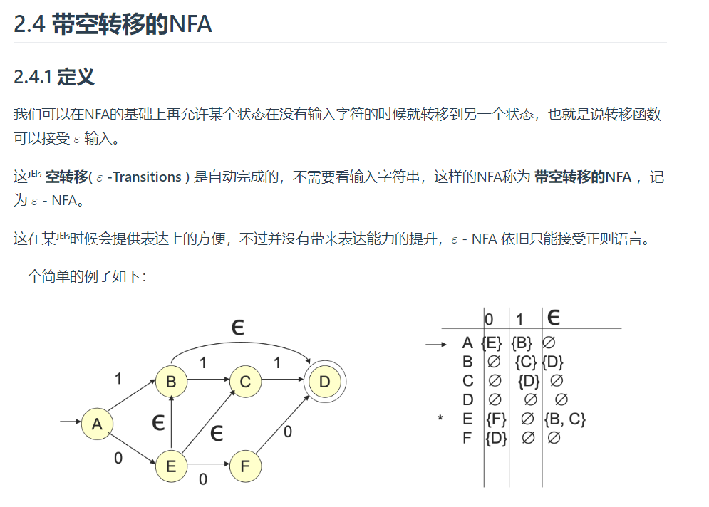

DFA：本质上是NFA的特例，每个NFA都有一个等价的DFA。即它们接受同样的语言。

### 从正则表达式到自动机

正则表达式可以简洁、精确地描述词法单元的模式，但是在进行模式匹配时需要模拟DFA的执行。

过程：两步走，正则->NFA, NFA->DFA。

#### 从NFA->DFA:子集构造法

理论上，最坏情况下DFA的状态个数会是NFA状态个数的指数多个。但是对于大部分应用，NFA和相应的DFA的状态数量大致相同。

由子集构造法，可以从NFA得到DFA。具体方法不列出。

#### DFA最小化：

对于每一个DFA，都存在一个接受同样语音的最少状态DFA。且一个给定语言的最少状态DFA（不计同构）是唯一的

#### 从正则表达式到NFA：

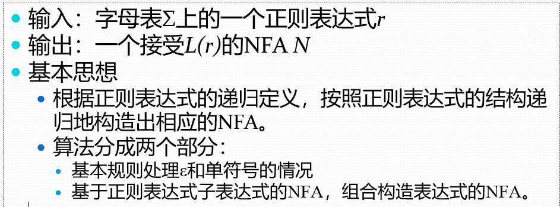

非常非常简单但巧妙的算法，体现了“递归定义的魅力”。

只需定义2个基本规则（处理$/epsilon$和$/alpha$两种路径），和三个归纳规则：正则表达式的并、连接、闭包的NFA。

具体实现见课本

## 语法分析

**任务**：接受一个终结符号串作为输入，找出从文法的开始符号推导出这个串的方法，如果不能得到这个推导方法，报告语法错误。

和词法分析的比较：

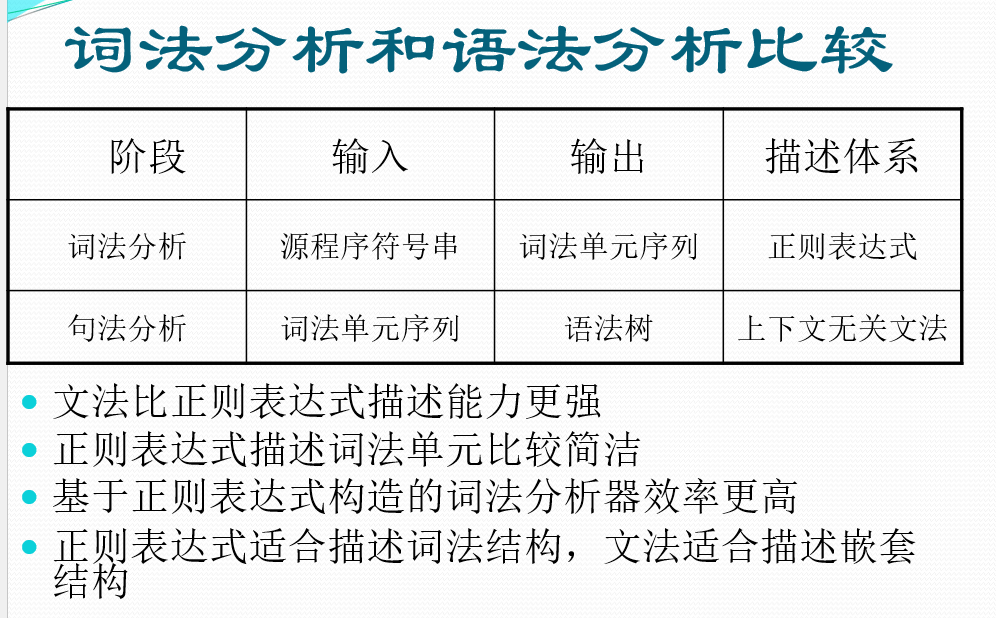

- 正则语言是上下文无关语言（CFL）的子集

- 每个正则表达式都可以用一个上下文无关文法来描述，反之不成立

- 例如：语言L = {a^n b^n | n>=0}，可以用CFG描述 ： S →aSb∣ε，但是正则表达式不能描述


